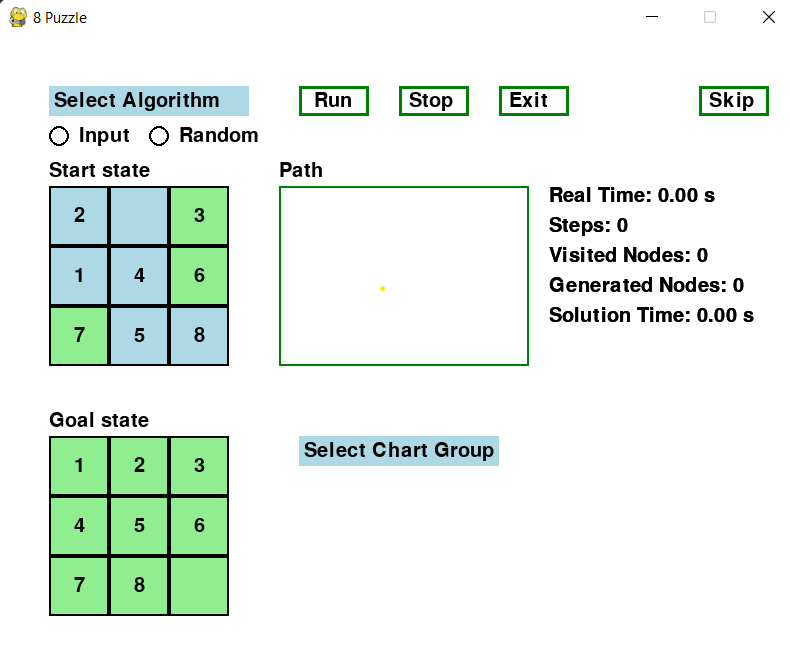
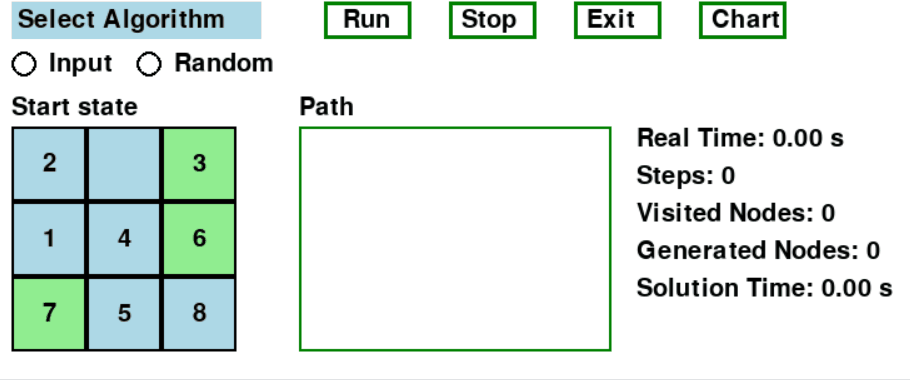
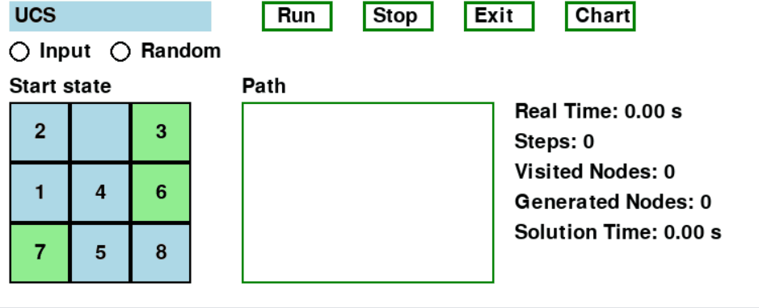
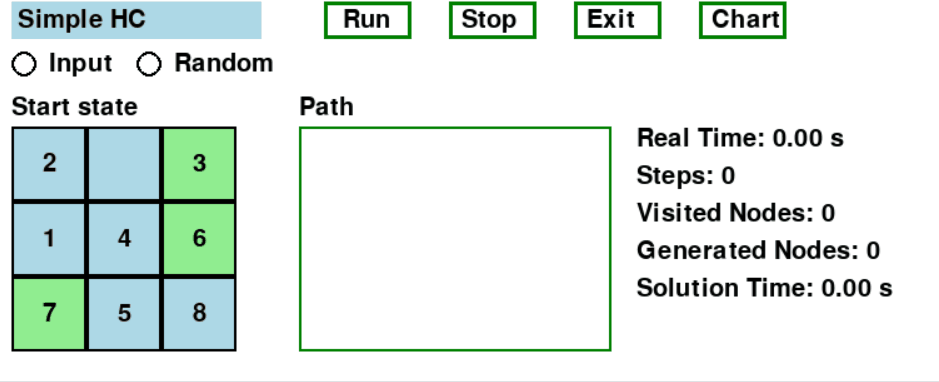
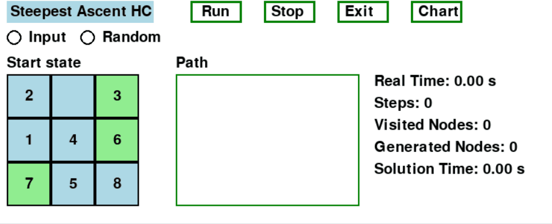
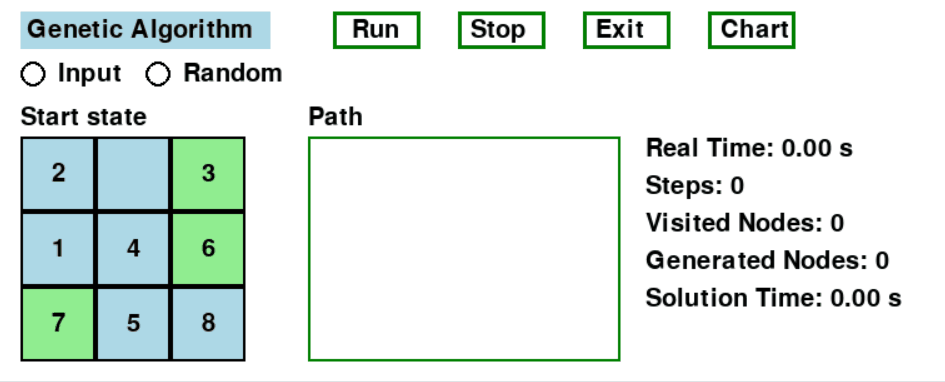
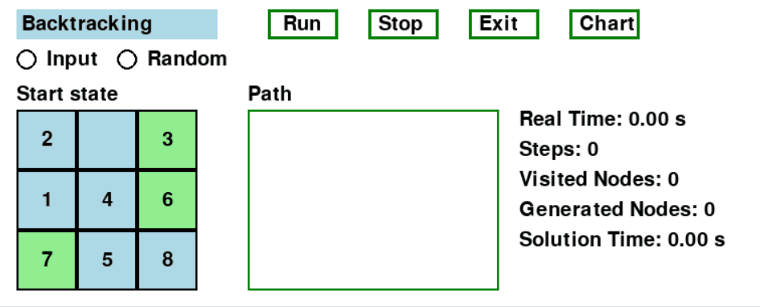
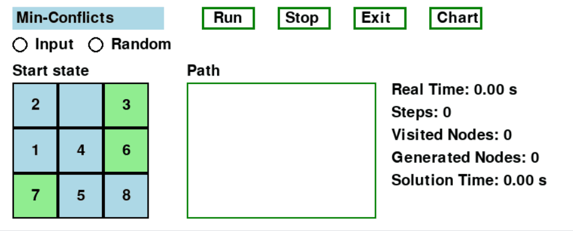
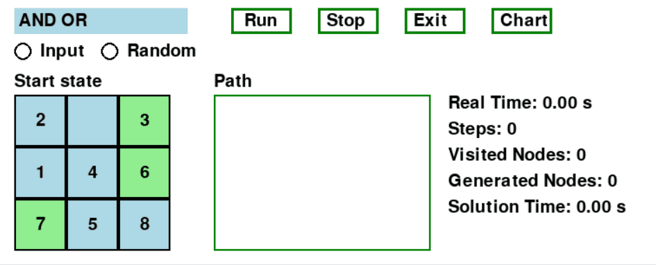

# TRÍ TUỆ NHÂN TẠO - ĐỒ ÁN CÁ NHÂN
# ÁP DỤNG CÁC THUẬT TOÁN TRONG AI VÀO BÀI TOÁN 8 PUZZLE
**Bài tập cá nhân môn Trí Tuệ Nhân Tạo (AI) Trần Thị Như Quỳnh - 23110299 - 8 Puzzle**
 
---

## 📌 Mục Lục

- [Giới thiệu](#giới-thiệu)
- [Các thuật toán tìm kiếm](#các-thuật-toán-tìm-kiếm)
  - [1. Nhóm thuật toán Uninformed Search](#1-nhóm-thuật-toán-uninformed-search)
    - [BFS](#breadth-first-search-bfs)
    - [DFS](#depth-first-search-dfs)
    - [Iterative Deepening DFS](#iterative-deepening-dfs)
    - [Uniform Cost Search](#uniform-cost-search)
  - [2. Nhóm thuật toán Informed Search](#2-nhóm-thuật-toán-informed-search)
    - [Greedy Search](#greedy-search)
    - [A* Search](#a-search)
    - [IDA* Search](#ida-search)
  - [3. Nhóm thuật toán Local Search](#3-nhóm-thuật-toán-local-search)
    - [Simple Hill Climbing](#simple-hill-climbing)
    - [Steepest Hill Climbing](#steepest-hill-climbing)
    - [Beam Search](#beam-search)
    - [Stochastic Hill Climbing](#stochastic-hill-climbing)
    - [Simulated Annealing](#simulated-annealing)
    - [Genetic Algorithm](#genetic-algorithm)
  - [4. Nhóm thuật toán CSPs - Ràng buộc](#4-nhóm-thuật-toán-csps---ràng-buộc)
    - [Backtracking Search](#backtracking-search)
  - [5. Nhóm thuật toán tìm kiếm môi trường phức tạp](#5-nhóm-thuật-toán-tìm-kiếm-môi-trường-phức-tạp)
    - [Sensorless BFS](#sensorless-bfs)
    - [AND-OR Search](#and-or-search)
  - [6. Nhóm thuật toán Học tăng cường (Reinforcement Learning)](#6-nhóm-thuật-toán-học-tăng-cường-reinforcement-learning)
    - [Q-Learning](#q-learning)
- [📊 Tổng kết](#tổng-kết)

---

## 🧠 Giới Thiệu

Dự án này triển khai nhiều thuật toán tìm kiếm trong trí tuệ nhân tạo thông qua bài toán 8-Puzzle, một trò chơi đơn giản nhưng đủ phức tạp để thể hiện cách thức hoạt động của các phương pháp giải quyết vấn đề.

Các thuật toán được triển khai trong dự án này được phân thành 6 nhóm chính:

- **Thuật toán tìm kiếm mù (Uninformed Search)**
- **Thuật toán tìm kiếm có thông tin (Informed Search)**
- **Thuật toán leo đồi và biến thể, di truyền (Local Search)**
- **Thuật toán dựa trên ràng buộc (CSPs)**
- **Thuật toán tìm kiếm trong môi trường phức tạp (Complex Environment)**
- **Thuật toán học tăng cường (Reinforcement Learning)**

## 🔧 Công nghệ sử dụng
- **Thư viện Pygame thiết kế giao diện trực quan**
- **Thư viện Matplotlib tạo biểu đồ thống kê**

Giao diện trực quan của dự án được thiết kế để người dùng có thể theo dõi từng bước giải bài toán, qua đó nắm bắt sâu sắc cách thức hoạt động của các thuật toán này.
- **Giao diện chính của bài toán 8 Puzzle**

---

## 📚 Các thuật toán tìm kiếm

### 1. Nhóm thuật toán Uninformed Search
Các thuật toán trong nhóm này hoạt động mà không sử dụng bất kỳ thông tin định hướng (heuristic) nào về trạng thái mục tiêu. Chúng đánh giá các trạng thái chỉ dựa trên cấu trúc không gian tìm kiếm, do đó thường có hiệu năng thấp trong các không gian trạng thái lớn.
#### Breadth-First Search (BFS)
BFS là thuật toán tìm kiếm theo chiều rộng, mở rộng tuần tự các nút ở độ sâu thấp nhất trước khi xét đến các mức sâu hơn. Cấu trúc dữ liệu chính là hàng đợi (FIFO).
- **Ưu điểm:** Đảm bảo tìm được đường đi ngắn nhất nếu chi phí bước đồng nhất.
- **Nhược điểm:** Tiêu tốn rất nhiều bộ nhớ.
- **Độ phức tạp:**  
  - Thời gian: O(b^d)  
  - Không gian: O(b^d)
    
   
  
📎 [Xem đoạn code Breadth-First Search (BFS)]

#### Depth-First Search (DFS)
DFS là thuật toán tìm kiếm theo chiều sâu, mở rộng một nhánh đến mức sâu tối đa trước khi quay lui. Dùng ngăn xếp (LIFO) hoặc đệ quy.
- **Ưu điểm:** Tiết kiệm bộ nhớ hơn BFS.
- **Nhược điểm:** Không đảm bảo tìm đường ngắn nhất, có thể rơi vào vòng lặp vô hạn.
- **Độ phức tạp:**  
  - Thời gian: O(b^m)  
  - Không gian: O(b*m)

 
    
📎 [Xem đoạn code Depth-First Search (DFS)]
#### Iterative Deepening 
Là sự kết hợp giữa DFS và BFS, IDS thực hiện DFS với các độ sâu giới hạn và tăng dần độ sâu cho đến khi tìm thấy giải pháp.
- **Ưu điểm:**
- **Nhược điểm:**

  

📎 [Xem đoạn code Iterative Deepening ]
#### Uniform Cost Search
UCS là thuật toán tìm kiếm dựa hoàn toàn vào chi phí thực tế g(n) mà không sử dụng heuristic. Nó mở rộng các trạng thái theo thứ tự tăng dần của chi phí, đảm bảo luôn tìm được đường đi có chi phí thấp nhất nếu mọi bước đi đều có chi phí dương. 

  
  

📎 [Xem đoạn code Uniform Cost Search]

### 2. Nhóm thuật toán Informed Search
Các thuật toán trong nhóm này sử dụng các hàm đánh giá heuristic nhằm ước lượng chi phí hoặc khoảng cách từ trạng thái hiện tại đến trạng thái mục tiêu. Nhờ đó, chúng có thể dẫn đường tìm kiếm một cách hiệu quả hơn, giảm thiểu số trạng thái cần mở rộng so với các thuật toán không có thông tin.
#### Greedy Search
- **Ưu điểm:**
- **Nhược điểm:**
  
  
  
📎 [Xem đoạn code Greedy Search]
#### A* Search
A* sử dụng công thức f(n) = g(n) + h(n), trong đó g(n) là chi phí thực tế từ trạng thái đầu đến n, còn h(n) là chi phí ước lượng từ n đến trạng thái mục tiêu. A* luôn mở rộng trạng thái có f(n) nhỏ nhất.
- **Ưu điểm:**
- Tối ưu, nếu heuristic không vượt quá chi phí thực tế.
- **Nhược điểm:**
- Tốn nhiều bộ nhớ, lưu trữ toàn bộ các trạng thái đã xét và hàng đợi ưu tiên.
- Dễ bị quá tải bộ nhớ với không gian trạng thái lớn.
  
  
📎 [Xem đoạn code A* Search]

#### IDA* Search
IDA* kết hợp ưu điểm của A* và IDDFS, bằng cách thực hiện tìm kiếm theo chiều sâu với ngưỡng giới hạn dần dần dựa trên giá trị hàm f(n). Thuật toán tránh được vấn đề về bộ nhớ lớn của A*.
- **Ưu điểm:**
- **Nhược điểm:**
  
  
  
📎 [Xem đoạn code IDA* Search]

### 3. Nhóm thuật toán Local Search
Nhóm thuật toán Local Search bao gồm các phương pháp tìm kiếm giải pháp trong không gian tìm kiếm bằng cách cải thiện dần dần một giải pháp hiện tại. Các thuật toán trong nhóm này thường được sử dụng cho các bài toán tối ưu hóa, nơi mà việc tìm kiếm toàn bộ không gian giải pháp là không khả thi. Dưới đây là một số thuật toán tiêu biểu trong nhóm này:
#### Simple Hill Climbing
Simple Hill Climbing là một thuật toán tìm kiếm đơn giản, trong đó nó bắt đầu từ một giải pháp ngẫu nhiên và lặp đi lặp lại việc di chuyển đến các giải pháp lân cận tốt hơn cho đến khi không còn giải pháp nào tốt hơn. Mặc dù thuật toán này dễ triển khai, nhưng nó có thể bị mắc kẹt trong các cực tiểu cục bộ.
- **Ưu điểm:**
- Giúp tránh bị mắc kẹt trong các cực tiểu cục bộ.
- Có khả năng tìm kiếm giải pháp tốt hơn trong không gian lớn.
- **Nhược điểm:**
- Dễ bị mắc kẹt trong các cực tiểu cục bộ.
- Không đảm bảo tìm được giải pháp tối ưu toàn cục.
  
  
  
📎 [Xem đoạn code Simple Hill Climbing]
#### Steepest Ascent Hill Climbing
Steepest Ascent Hill Climbing là một biến thể của thuật toán Simple Hill Climbing, trong đó nó chọn giải pháp tốt nhất trong số các giải pháp lân cận.
- **Ưu điểm:**
- Tăng khả năng tìm kiếm giải pháp tối ưu hơn so với Simple Hill Climbing.
- Có thể tìm ra giải pháp tốt hơn trong một số trường hợp.
- **Nhược điểm:**
- Thời gian tính toán có thể lâu hơn do phải đánh giá tất cả các giải pháp lân cận.
- Có thể mắc kẹt trong các cực tiểu cục bộ.
  
  

📎 [Xem đoạn code Steepest Ascent Hill Climbing]
#### Beam Search
Beam Search là một thuật toán tìm kiếm có giới hạn, trong đó nó giữ lại một số lượng nhất định các giải pháp tốt nhất tại mỗi bước.
- **Ưu điểm:**
- Giảm thiểu thời gian tính toán so với các thuật toán tìm kiếm toàn bộ.
- Tập trung vào các giải pháp hứa hẹn nhất.
- **Nhược điểm:**
- Có thể bỏ lỡ các giải pháp tốt hơn nằm ngoài phạm vi beam.
- Kết quả phụ thuộc vào kích thước của beam.
  
  
  
📎 [Xem đoạn code Beam Search]
#### Stochastic Hill Climbing
Stochastic Hill Climbing là một biến thể của thuật toán Hill Climbing, trong đó nó chọn ngẫu nhiên một giải pháp lân cận để di chuyển đến.
- **Ưu điểm:**
- Giúp tránh bị mắc kẹt trong các cực tiểu cục bộ.
- Có khả năng tìm kiếm giải pháp tốt hơn trong không gian lớn.
- **Nhược điểm:**
- Kết quả có thể không ổn định do tính ngẫu nhiên.
- Thời gian tính toán có thể dài hơn so với các thuật toán xác định.
  
  
  
📎 [Xem đoạn code Stochastic Hill Climbing]
#### Simulated Annealing
Simulated Annealing lấy cảm hứng từ quá trình ủ nhiệt trong luyện kim, bắt đầu bằng cách chọn một trạng thái hiện tại và thử chuyển sang trạng thái kế tiếp một cách ngẫu nhiên. Thuật toán có thể chấp nhận một trạng thái xấu hơn với xác suất giảm dần theo thời gian, nhằm tránh bị kẹt ở cực trị địa phương. Việc lựa chọn trạng thái kế tiếp dựa trên một hàm heuristic, thường là số ô sai vị trí hoặc khoảng cách Manhattan đến trạng thái đích.
- **Ưu điểm:**
- Có khả năng tìm kiếm giải pháp tối ưu toàn cục.
- Tránh được kẹt local optimum, có thể tìm được lời giải tốt trong không gian trạng thái lớn.
- **Nhược điểm:**
- Thời gian tính toán có thể dài, đặc biệt nếu không điều chỉnh đúng các tham số.
- Cần phải thiết lập các tham số như nhiệt độ và tốc độ làm nguội một cách hợp lý.
  
 
  
📎 [Xem đoạn code Simulated Annealing]
#### Genetic Algorithm
Genetic Algorithm là một thuật toán tối ưu hóa dựa trên nguyên lý chọn lọc tự nhiên. Nó sử dụng các cá thể (giải pháp) trong một quần thể và áp dụng các phép lai ghép, đột biến để tạo ra các thế hệ mới.
- **Ưu điểm:**
- Có khả năng tìm kiếm giải pháp tối ưu trong không gian lớn và phức tạp.
- Tính linh hoạt cao, có thể áp dụng cho nhiều loại bài toán khác nhau.
- Có khả năng thoát khỏi các cực tiểu cục bộ nhờ vào cơ chế lai ghép và đột biến.
- **Nhược điểm:**
- Thời gian tính toán có thể lâu do cần nhiều thế hệ để đạt được kết quả tốt.
- Kết quả có thể không ổn định và phụ thuộc vào các tham số như tỷ lệ đột biến và tỷ lệ lai ghép.
- Cần thiết lập các tham số một cách hợp lý để đạt hiệu quả tối ưu.
  
 
  
📎 [Xem đoạn code Genetic Algorithm]

### 4. Nhóm thuật toán CSPs - Ràng buộc
Nhóm thuật toán CSPs (Constraint Satisfaction Problems) tập trung vào việc giải quyết các bài toán mà trong đó các biến phải thỏa mãn một tập hợp các ràng buộc.
#### Backtracking Search
Backtracking Search là một thuật toán tìm kiếm có hệ thống, trong đó nó thử nghiệm từng khả năng cho đến khi tìm được một giải pháp thỏa mãn tất cả các ràng buộc. Nếu một lựa chọn không dẫn đến giải pháp, thuật toán sẽ quay lại (backtrack) và thử lựa chọn khác.
- **Ưu điểm:**
- Có thể tìm ra tất cả các giải pháp khả thi nếu cần thiết.
- Hiệu quả cho các bài toán nhỏ hoặc khi số lượng ràng buộc không quá lớn.
- **Nhược điểm:**
- Thời gian tính toán có thể rất lâu cho các bài toán lớn do số lượng khả năng tăng theo cấp số nhân.
- Có thể bị mắc kẹt trong các nhánh không khả thi mà không có cách nào để loại bỏ sớm.
  
 
  
📎 [Xem đoạn code Backtracking Search]

#### Min-Conflicts
Thuật toán này giải quyết bài toán bằng cách lặp đi lặp lại việc chọn một biến có mâu thuẫn và gán lại giá trị cho biến đó sao cho số lượng ràng buộc vi phạm được giảm thiểu. Việc chọn biến có mâu thuẫn được thực hiện bằng cách tìm kiếm các biến liên quan đến số lượng ràng buộc vi phạm cao nhất.
- **Ưu điểm:**
- **Nhược điểm:**

📎 [Xem đoạn code Min - Conflicts]

### 5. Nhóm thuật toán tìm kiếm môi trường phức tạp
Nhóm thuật toán tìm kiếm môi trường phức tạp tập trung vào việc giải quyết các bài toán trong các môi trường không chắc chắn hoặc không đầy đủ thông tin. Các thuật toán trong nhóm này thường được sử dụng trong các ứng dụng như robot tự hành, trò chơi và các hệ thống thông minh.
#### Sensorless BFS
Sensorless BFS (Breadth-First Search) là một thuật toán tìm kiếm trong đó không có thông tin cảm biến về trạng thái hiện tại của môi trường. Thuật toán này khám phá tất cả các trạng thái khả thi từ một trạng thái ban đầu mà không cần biết chính xác vị trí hiện tại.

 

📎 [Xem đoạn code Sensorless BFS]
#### AND-OR Search
AND-OR Search là một thuật toán tìm kiếm được sử dụng để giải quyết các bài toán có cấu trúc phức tạp, trong đó các quyết định có thể dẫn đến nhiều nhánh khác nhau. Thuật toán này sử dụng cấu trúc cây để phân tích các lựa chọn và tìm kiếm giải pháp.
- **Ưu điểm:**
- Có khả năng xử lý các bài toán phức tạp với nhiều nhánh và quyết định.
- Có thể tìm ra giải pháp tối ưu cho các bài toán có cấu trúc AND-OR.
- **Nhược điểm:**
- Cần nhiều tài nguyên tính toán và bộ nhớ để lưu trữ cấu trúc cây.
- Có thể khó triển khai và tối ưu hóa cho các bài toán lớn.
  
 
  
📎 [Xem đoạn code  AND-OR Search]

### 6. Nhóm thuật toán Học tăng cường (Reinforcement Learning)
Nhóm thuật toán Học tăng cường (Reinforcement Learning) tập trung vào việc phát triển các tác nhân (agents) có khả năng học hỏi từ môi trường thông qua việc tương tác và nhận phản hồi dưới dạng phần thưởng.
#### Q-Learning
Q-Learning là một thuật toán học tăng cường không cần mô hình, trong đó tác nhân học cách tối ưu hóa hành động của mình thông qua việc cập nhật giá trị Q cho từng cặp trạng thái-hành động. Giá trị Q đại diện cho giá trị kỳ vọng của việc thực hiện một hành động cụ thể trong một trạng thái cụ thể.
- **Ưu điểm:**
- Không cần biết trước mô hình của môi trường, có thể áp dụng cho nhiều loại bài toán khác nhau.
- Có khả năng tìm ra chính sách tối ưu cho tác nhân thông qua việc học từ kinh nghiệm.
- **Nhược điểm:**
- Thời gian học có thể dài, đặc biệt trong các môi trường phức tạp với nhiều trạng thái và hành động.
- Cần một lượng lớn dữ liệu để đạt được hiệu suất tốt.
- Có thể không hội tụ đến chính sách tối ưu nếu không điều chỉnh đúng các tham số như tốc độ học.
  
 

📎 [Xem đoạn code Q-Learning]
---

## 📊 Tổng Kết

- Dự án giúp sinh viên **hiểu sâu sắc về các nhóm thuật toán tìm kiếm trong AI**
- Cung cấp nền tảng cho các ứng dụng mở rộng trong lĩnh vực tự động hóa, robot, và lập kế hoạch.

---

## 📬 Liên hệ

Mọi góp ý xin gửi về: **ttnquynh20@gmail.com**

---

